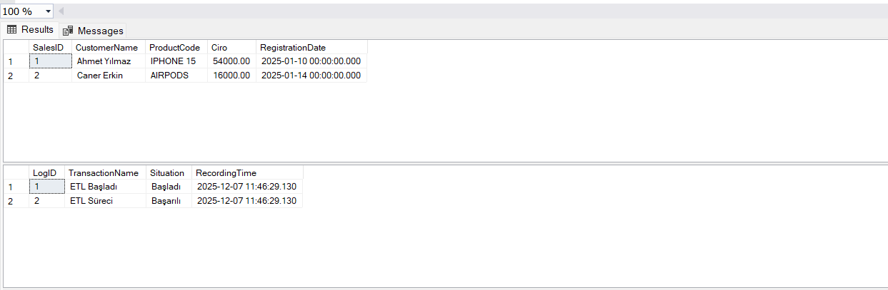

###  ETL Data Pipeline Automation with T-SQL ⚙️
Kirli ve düzensiz verilerin otomatik olarak temizlenmesi, dönüştürülmesi ve raporlama katmanına taşınmasını sağlayan T-SQL Otomasyon projesi.

**🎯 İş Problemi:**
Kaynak sistemlerden gelen verilerde hatalı veri tipleri (String price), negatif değerler ve eksik bilgiler bulunmaktadır. Bu verilerin manuel temizlenmesi yerine, otomatize edilmiş bir **ETL (Extract-Transform-Load)** süreci gerekmektedir.

**🛠️ Kullanılan Teknikler:**
* **Stored Procedures:** Tüm iş mantığı 'sp_ETL_Satislar' prosedürü içine paketlendi.
* **Data Cleaning:** 'TRY_CAST' fonksiyonu ile hatalı veri tipleri filtrelendi ve dönüştürüldü.
* **Transaction Management:** Veri bütünlüğü için 'BEGIN TRANSACTION', 'COMMIT' ve 'ROLLBACK' yapıları kullanıldı.
* **Logging Mechanism:** Her işlemin durumu ve hatalar 'Transaction_Logs' tablosuna otomatik kaydedildi.

